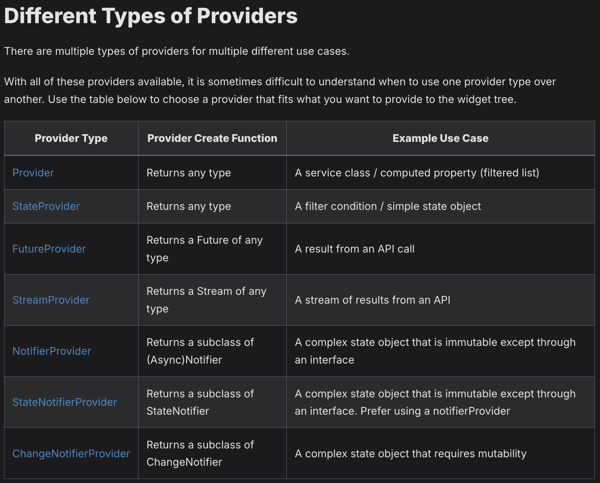

# RiverPod Docs 공부하기

처음에는 플러터 조금 끄적이다가 리버팟이 문서가 어떻게 되있는지 갑자기 궁금해져서 검색해봄, Riverpod을 공부 할 수 있는 사이트가 잘되어있어서 공부시작
> 참고링크 :   https://riverpod.dev/ko/

# 공부 순서
문서 읽는데 무슨말 하는지 하나도 모르겠음,
지피티에게 물어봄

_지피티 : ㄴㄴ, 님 그렇게 말고 단계별로 진행하셈, 알려드림_

1. provider의 개념, 사용법, 종류

2. RiverPod 문서를 한번에 다 읽지 말고 단계별로 세분화 해서 읽을것( riverpod 개요 / riverpod 종류 / riverpod 상태관리 패턴 - watch, read, notify)

3. 상태변경과 UI업데이트

---

# 기본기 : Provider
- Provider의 개념_1 : Singletons, Service Locators, Dependency Injection, InheritedWidget의 개념을 하나로 다룰수 있는 편리한 도구라고 보면됨
(추후 GPT한테 물어봐서 Singletons, Service 등 4가지 Dart로 구현해보기) 

- Provider의 개념_2 : 근데 가장 중요한 핵심적인 개념은 상태관리를 부모에서 자식에게 넘겨주고 또 넘겨주고 반대로 자식에서 부모에게로 위로 올리고 하는 번거로운 작업을 더욱  편리하게 처리하기위해서 매개변수로 받는것이 아닌 아예 밖으로 빼내서 제 3의 창고에 보관해서 빼고 쓰는것이 가장 핵심적인 개념임

- Provider의 개념_3 : 그래서 전역적으로 사용하기 위해서 void main() {} 안에 runApp()이 선언되기 전에 ProviderScope로 감싸주는게 그 이유임 가장 최상위의 위젯이니, 어디든 접근이 가능한거임

- Provider의 개념_4 : 코드를 누구나 함부로 손대지 못하도록 Provider패키지 안에서는 __불변성(immutable)__ 만들어져있음 한마디로 말해 읽기전용으로 패키지가 구성되어있으며, 자바로 치면 getter의 개념임
그래서 값을 변경하기 위해서 StateNotifier나 StateNotifierProvider가 필요하다.
(정확한건 아니지만 setter가 되는 StateNotifier or StateNotifierProvider)

- Provider의 개념_5 : 코드 안에서 Provider를 사용하려면 ref라는 값이 필요함
이 ref는 flutter가 기본으로 제공하는 매개변수값이아니기 때문에 위젯을 변경해주어야함
(statelessWidget -> ConsumerWidget)
(statefulWidget -> ConsumerStatefulWidget)
(빌드가 되고 싶은 위젯부분에 Consumer로 감싸 준뒤 (context, ref, child) {} 을 이용하여 ref값 얻어내기)
결국엔 ref 값을 얻어내기 위한 코드였던거임

# 객체의 전체 필드값을 구독 vs 객체의 일부 값을 구독 (lib / lab_1을 참고하기)
- 객체를 구독하는 것이 이전까지 내가 알고있던 전부였다. 신기하게도 객체뿐만 아니라 좀 더 정밀하게 객체의 필드값을 구독하는 것도있다.

- 무엇이 다른걸까?

> _객체를 구독하게 된다면(User)_
객체의 한 부분만 달라져도 리빌딩된다. 화면이 다시 그려지기 때문에 만약 값이 실시간으로 변하는 구글맵이라든지, 많은 필드값을 가지고 있는 점에 대해서는 무수히 많은 깜빡임과 API요청이 끊임 없이 발생할것이다.
```
final user = ref.watch(userProvider); 
```

>  _객체의 필드값만을 구독하게 된다면(User.name)_
name만 변경됨에 따라 UI가 변경이 되기에 User의 나이, 이메일, 주소, 기타 등등 이 변경되도 UI의 변화는 없다. 매우 효율적인 코드가 된다는 점이다. 불필요한 API사용이 없으며, front / back 둘다 효과적인 방안이다. 
```
final name = ref.watch(userProvider.select((user) => user.name))
```
---
# Provider의 종류
